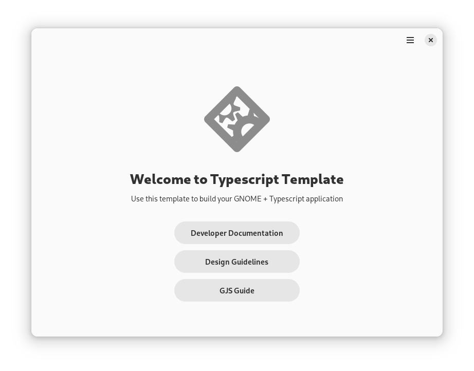

# GNOME Typescript Template

A template that provides the basic foundations for GNOME applications written in Typescript.



## Template Features

This template provides:

* A main window using modern libadwaita widgets and best practices
* A starting point for metadata, desktop files, and icons
* A flatpak manifest for nightly builds
* A GitLab CI configuration that produces flatpak bundles
* A stub for translation support
* Thoroughly commented code to assist with learning

## Getting Started

This template comes with a `create-project.py` script. When you're ready to initialize your project,
navigate to your checkout of the template and run the following command in the terminal:

```
# NOTE: Don't copy the `$`. It's simply an indicator
# that you should run a command as a regular user.
$ python3 create-project.py
```

The script will ask you for your project name, application id, and author information and then
replace the placeholder values in the template with the values you provide. Once finished,
you will find a folder with the project name you gave the script in the template repo. Move
this folder to wherever you store your projects.

## Setting Up Your Development Environment

### Visual Studio Code

When working with Typescript, I currently recommend using [Visual Studio Code](https://flathub.org/apps/com.visualstudio.code).
VSCode has many well-supported extensions for JavaScript and TypeScript. You will need the following extensions in VSCode:

* ESLint by Microsoft
* Prettier ESLint by Rebecca Vest
* Flatpak by Bilal Elmoussaoui
* XML by Red Hat
* EditorConfig for VS Code by EditorConfig
* Meson by mesonbuild

### Flatpak

You will also need to install the GNOME Nightly flatpak SDK and the Node and Typescript
SDK extensions. First, add the flatpak repositories if you have not already configured them.
In a terminal, run:

```
$ flatpak remote-add --user --if-not-exists flathub https://flathub.org/repo/flathub.flatpakrepo
$ flatpak remote-add --user --if-not-exists flathub-beta https://flathub.org/beta-repo/flathub-beta.flatpakrepo
$ flatpak remote-add --user --if-not-exists gnome-nightly https://nightly.gnome.org/gnome-nightly.flatpakrepo
```

Then install the SDKs and extensions:

```
$ flatpak --user install org.gnome.Sdk//master org.gnome.Platform//master
$ flatpak --user install org.freedesktop.Sdk.Extension.node18//23.08beta org.freedesktop.Sdk.Extension.typescript//23.08beta
```

Also ensure that you have `flatpak-builder` installed.

### Node Package Manager & ESLint

This step is optional, but highly recommended for setting up linting and code formattting.
Install `npm`, then run `npm install` in your project directory.

## Building & Running Your App

### In VS Code

When you open your project directory in VS Code, you should see a box icon on the bottom left
of your screen with your application ID. If you see this and no errors, that means that the
flatpak VS Code extension properly loaded your project.

Open your command palette (View -> Command Palette in the menu bar, or Ctrl+Shift+P) and
type "Flatpak". Select "Flatpak: Build" from the list. Once the build is done, open the
command palette again and select "Flatpak: Run". You should see the window depicted in
the screenshot at the top of this file.

After your initial build, you can use the "Flatpak: Build and Run" action from the
command palette to do both steps at once.

### In The Terminal

To build the application, run:

```
$ flatpak-builder --user flatpak_app build-aux/flatpak/<application_id>.json
```

And to run the application:

```
$ flatpak-builder --run flatpak_app build-aux/flatpak/<application_id>.json
```

## References

For the next steps in your application development journey, visit the following links:

* Read our [Developer Documentation](https://developer.gnome.org/documentation/) for tutorials and references.
* Read our [Human Interface Guidelines](https://developer.gnome.org/hig/) to learn the best practices for designing a GNOME application.
* Visit [gjs.guide](https://gjs.guide/) for a comprehensive overview of GJS.
* If you plan to host your repo on GitHub, set up [flatpak-github-actions](https://github.com/flatpak/flatpak-github-actions).